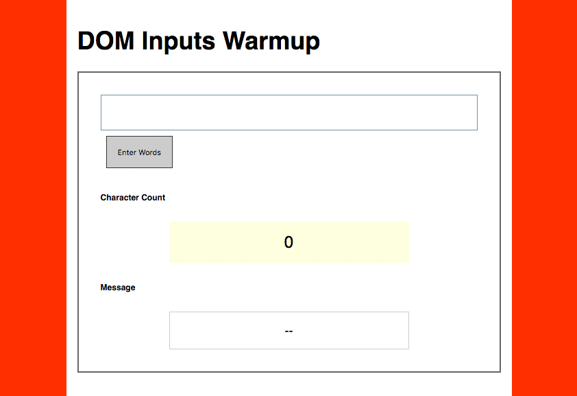

# JS - DOM Manipulations - Conditional Counter

### The Demo

### Normal


##### Description
Put an event listener on the button that counts the characters in the `<input type="text" class="user-input">`. Put the output in the `<p class="char-count">` element.

*Hint* : You will need to access `<input>` element's `value` property to access the text.

### Adventure Mode


1 - Put an event listener on the input that counts the characters as the user types and updates the output in the `<p class="char-count">` element.

*Hint* : You will need to reference the `<input>` element's keydown event.

2 - Also, when the user pushes the button, the number of characters `<input>` value should be reduced down to the max character count.

*Hint* : You will need to count the length of the `<input>` element's `value` property AND you will need to reassign it (with the string `.slice()` method).

### Setup
```sh
# 1- go to warmups
cd ~/Documents/muktek/warmups

# 2- clone the repo
git clone git@github.com:muktek/activity--dom-inputs-wordcount.git

# 3- open in the browser
firefox index.html

# 4- open in atom
atom .
```
